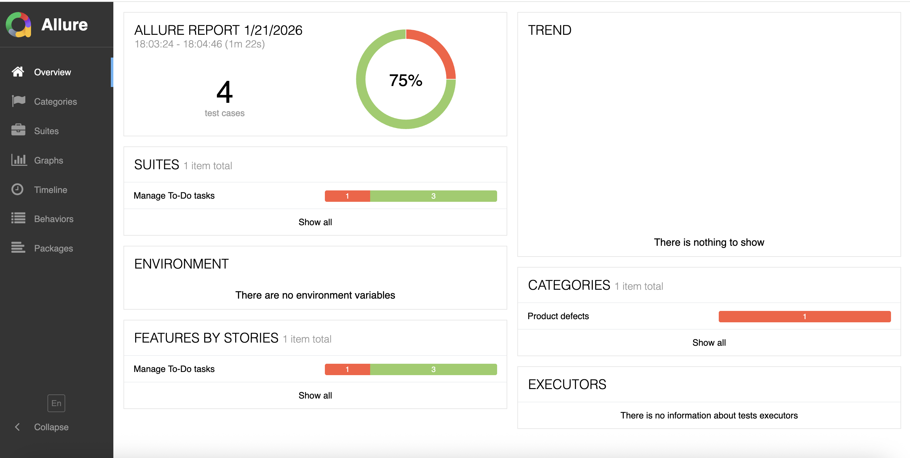

# 📱 iOS To-Do App — Automated Tests (Appium + Java + Cucumber + Allure)

## 🧩 Overview

This project contains **automated UI tests** for an iOS To-Do application, built as an educational and portfolio project.

It demonstrates how to create a clean, maintainable mobile automation framework from scratch using modern tools and best practices.

Key goals:
	- realistic user scenarios
	- readable BDD tests
	- professional reporting with screenshots
	- real device testing (not simulator-only)

---

## 🚀 Tech Stack
| Tool | Purpose |
|------|----------|
| **Java 17** | Programming language |
| **Appium 8+** | iOS mobile automation |
| **XCUITest** | iOS automation engine |
| **Selenium 4** | WebDriver implementation |
| **Cucumber 7** | BDD (Gherkin scenarios) |
| **TestNG** | Test runner |
| **Allure** | Interactive test reports |
| **Maven** | Dependency and build management |

---

## 🧠 Project Structure
```
ios-todo-tests/
├── src/test/java/com/sashathe/
│   ├── pages/        # Page Object classes (BasePage, TodoMainPage)
│   ├── steps/        # Cucumber step definitions
│   ├── hooks/        # Driver setup & teardown + screenshots on failure
│   ├── tests/        # Test runners (RunCucumberTest)
│   └── config/       # DriverFactory, capabilities
│
├── src/test/resources/
│   └── features/     # .feature files (BDD scenarios)
│
├── pom.xml           # Maven configuration
├── README.md         # Project documentation
└── .gitignore
```

---

## 🧾 Test Scenarios Covered

✅ Launch application

✅ Verify main screen

✅ Add new item

✅ Delete item

✅ Reorder items (drag & drop)

✅ Swipe gestures (left / back)

✅ Edge swipe navigation (iOS native)

✅ Negative test (demo failed scenario for Allure)

✅ Screenshot on test failure

---

## 🧪 How to Run Tests

### 1️⃣ Start Appium Server
Start Appium Desktop or Appium Server CLI manually.
```shell

appium
```
### 2️⃣ Connect iOS device
Make sure your device is visible:
```shell

adb devices
```
### 3️⃣ Run all tests via Maven
```shell

mvn clean test
```
### 4️⃣ Generate and view Allure Report
```shell

allure serve allure-results
```
This command will open an interactive report in your browser.

---

## 📸 Example Allure Report

Below are real screenshots from Allure Reports generated in this project:

### 🧭 Dashboard overview


### 🧪 Test details with screenshot


---

## 🎥 Test Execution Demo


### 📹 screen recording of real device test execution


---

## ⚙️ Run Configuration

- **Platform:**  iOS 18+
- **Device:** iPhone 11 (real device)
- **Automation Name:** XCUITest
- **IDE:** IntelliJ IDEA
- **Execution:** Appium Server (local)

---

## 🎯 Purpose of the Project

This project was created to:

- demonstrate iOS automation skills with Appium
- apply BDD + Page Object architecture
- show real-world gesture handling (swipes, drag & drop)
- generate professional Allure reports
- serve as a portfolio project for Mobile QA roles

---

## 👨‍💻 Author

**Aliaksandr Nikalaichyk**  
📍 Warsaw, Poland

🔗 [GitHub](https://github.com/sashathe90)  
💼 [LinkedIn](https://www.https://www.linkedin.com/in/aliaksandr-nikalaichyk-02b669230/)  
✉️ [sashathe90@gmail.com](mailto:sashathe90@gmail.com)

---

## 🏁 Quick Summary

**Platform:** iOS (real device) 
**Automation:** Appium + Java 
**Style:** BDD (Cucumber)
**Architecture:** Page Object + BasePage
**Reports:** Allure with screenshots
**Goal:** Portfolio & educational demo project
